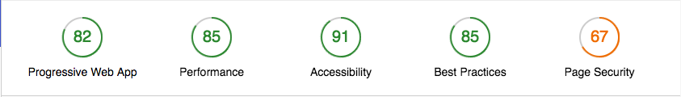
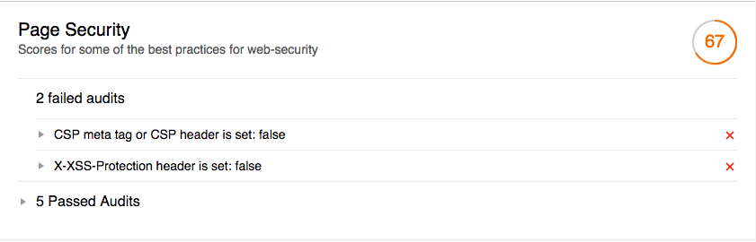

# [Lighthouse](https://github.com/GoogleChrome/lighthouse) Security [](https://npmjs.org/package/lighthouse-security)

**Runs the default Google Lighthouse tests with additional security tests.**




## Installation

```sh
npm install -g lighthouse-security
```

## Run from CLI

Run the command from CLI like displayed below. The options are the same as for
the [default Lighthouse CLI options](https://github.com/GoogleChrome/lighthouse#cli-options).

```sh
lighthouse-security <url> [options]
```

## Use in code

The extension can also be used within your code. A short example is given below.
To render reports etc. it is recommended to import functionality from Lighthouse.

```javascript
const lighthouseSecurity = require('lighthouse-security')

lighthouseSecurity(url, flags, config)
  .then(results => console.log(results))
```
